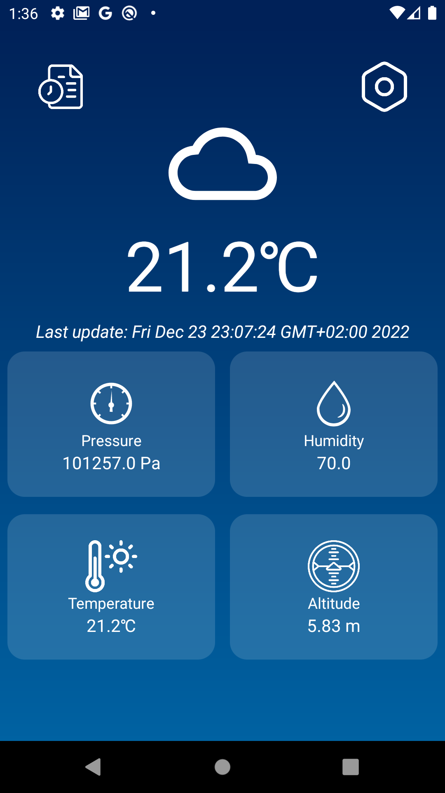
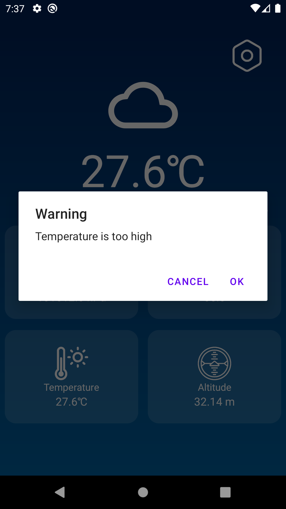
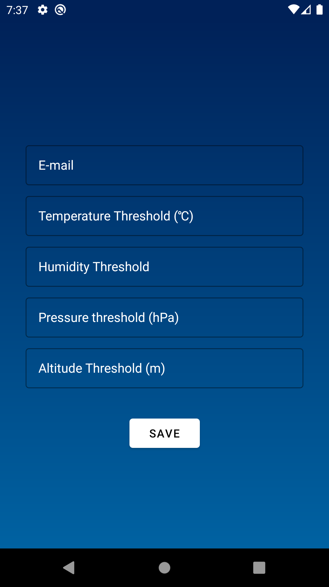
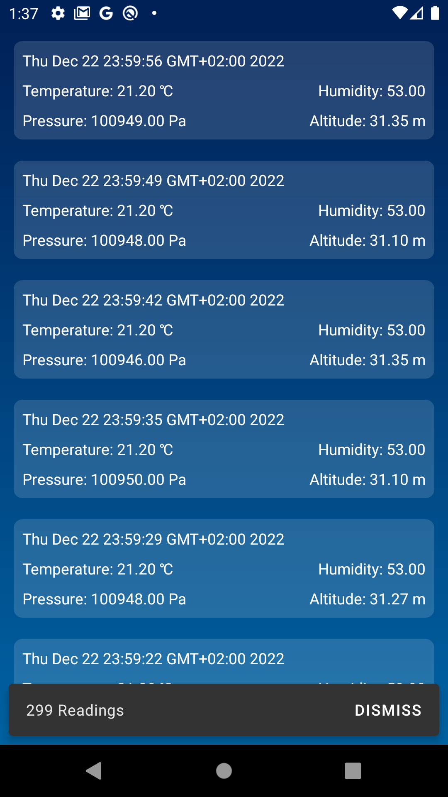

# Weather IOT Project

## About

Application to read data from a weather station and send it to a firebase real-time database. and
display it on an android app, with thresholds and alerts.

## Hardware
[Weather Server Station](https://github.com/bavllymagid/weather_server_station)
- ESP32
- DHT22 for measuring temperature and humidity
- BMP280 for measuring pressure and altitude

## Screenshots

<figure style = "display:inline-block">
    
    <figcaption align = "center">Home</figcaption>
</figure>
<figure style = "display:inline-block">
    
    <figcaption align = "center">Status Alert</figcaption>
</figure>
<figure style = "display:inline-block">
    
    <figcaption align = "center">User Settings</figcaption>
</figure>
<figure style = "display:inline-block">
    
    <figcaption align = "center">Readings Log</figcaption>
</figure>